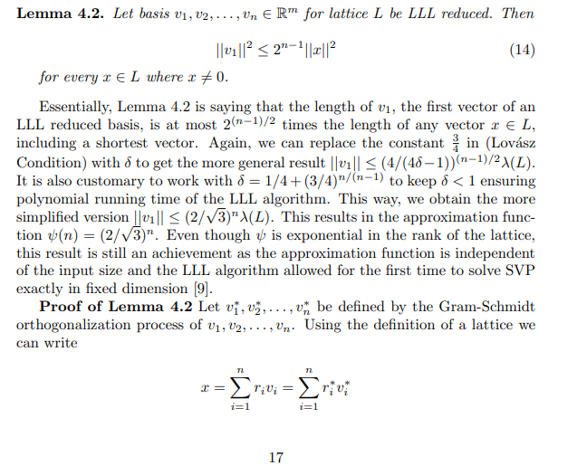

<!-- Nghĩa bổ sung -->
<!-- Nghĩa bổ sung -->
<!-- Nghĩa bổ sung -->
<!-- Nghĩa bổ sung -->
<!-- Nghĩa bổ sung -->
<!-- Nghĩa bổ sung -->
<!-- Nghĩa bổ sung -->
<!-- Nghĩa bổ sung -->
<!-- Nghĩa bổ sung -->
<!-- Nghĩa bổ sung -->
<!-- Nghĩa bổ sung -->
<!-- Nghĩa bổ sung -->
<!-- Nghĩa bổ sung -->
<!-- Nghĩa bổ sung -->
<!-- Nghĩa bổ sung -->
<!-- Nghĩa bổ sung -->
<!-- Nghĩa bổ sung -->
<!-- Nghĩa bổ sung -->

<!-- - Phát biểu bài toán - nêu rõ input và output -->
<!-- - Số mũ mã hóa cần giới hạn trong khoảng nào là nhỏ -->
<!-- - Định nghĩa thời gian đa thức là như thế nào -->

